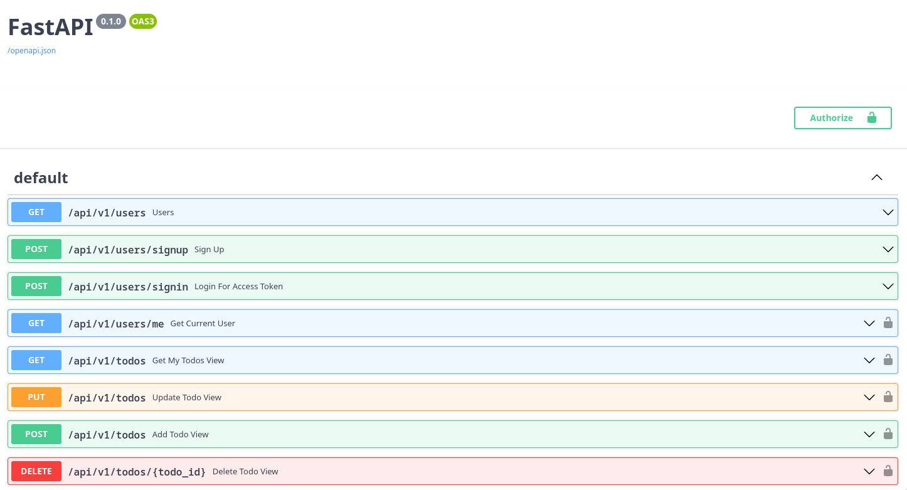

# Todo API

Interactive API at: <https://todo.minhtrannhat.com/docs>

<p align="center">
    
</p>

## Back-end Tech Stack

- Python 3.10
- FastAPI
- PostgreSQL
- Docker

## Features

### For clients:

- [CRUD](https://en.wikipedia.org/wiki/Create,_read,_update_and_delete) Functionality. Users are able to:
  - Create new account
  - Create new todo
  - View all todo items
  - View todo by ID
  - Delete todo by ID
  - Update todo by ID

### For developers:

- [Swagger UI](https://swagger.io/tools/swagger-ui) auto generated from OpenAPI, allows visualizing and interacting with the API without a front-end.
- Async functionalities built into FastAPI.
- Schemas are validated by [Pydantic](https://pydantic-docs.helpmanual.io/).
- Containerized with [Docker](https://www.docker.com/) and [Compose](https://docs.docker.com/compose/) for easy deployment.
- [pre-commit hook](https://pre-commit.com/) for auto linting before git commit.
- Api tests done by [Pytest](https://docs.pytest.org/) and [Tavern](https://taverntesting.github.io).

## Setup

Clone the repo: `git clone https://github.com/minhtrannhat/todo_app`

### Environment

- Change the content of the `environment` key in `docker-compose.yml` to your liking.
  ```
  - SQLALCHEMY_DB_URL=postgresql://fastapi_todo:fastapi_todo@db:5432/todo
  - SECRET_KEY='D8C013F4063E4CE4A67B3587A45FAD1F6D3241A0EA015C919A9E071CD5AA8273'
  - ALGORITHM='HS256'
  - ACCESS_TOKEN_EXPIRE_MINUTES=60
  ```

### Build using docker and docker-compose (recommended):

- Run the script `docker.sh` to build and get docker container up and running.

### Build without Docker:

- Install [poetry](https://python-poetry.org/) - the Python dependency management.
- `poetry shell` to create a virtual environment of the project.
- `poetry install` to install dependencies.
- `uvicorn fastapi_todo.app:app --host 0.0.0.0 --port 8000 --reload` to start the API service in development mode (hot reload).
- Go to `localhost:8000/docs` to access the interactive Swagger UI of the API.

> While developing, run `pre-commit install` before committing any changes. [pre-commit](https://pre-commit.com/) runs a style check through all changed files before committing. The rules of `pre-commits` are in `.pre-commit-config.yml` file.

## Testing

Prune old docker container, reset database and run tests by running this command: `./docker.sh prune && ./docker.sh && ./run_tests.sh`

## Deployment

The project is containerized and deployed with docker-compose and NGINX with SSL certificates signed by `certbot` on my personal Vultr VM.
